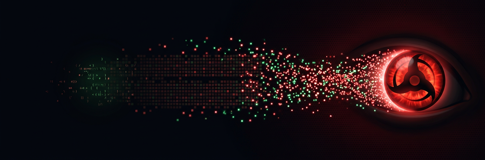

# CommitQuest ⚡🥷

**From `98% commits` to all-five legend.**

CommitQuest scans any GitHub profile, scores the *balance* of contribution types —
commits, pull requests, issues, reviews, discussions, repos — and hands you one-click
quests to unlock whatever's missing. No frameworks, no build step, no dependencies.

```text
🥷 Rank: Chūnin (3/6 types)
Commits 55 (98%) · PRs 1 · Issues 0 · Reviews 0
Missing: issues, reviews, discussions
```

## Why this exists

The repo owner's profile, snapshot 2026-08-29 (via GraphQL `contributionsCollection`):

| Contribution type | Count | Share |
|---|---:|---:|
| Commits | 55 | **98.2%** |
| Pull requests | 1 | 1.8% |
| Issues | 0 | 0% |
| Reviews | 0 | 0% |

Classic commit-only shinobi. Powerful chakra, one jutsu. This project is the fix —
**a dashboard that measures the problem and a quest board that solves it**,
built to be earned with: every type you're missing can be unlocked *inside this very repo*.

## Features

- 🔍 **Scan any public profile** — live from the GitHub API (estimate mode, no token needed)
- 🎯 **Exact mode** — paste a PAT (no scopes required) and read true yearly totals via GraphQL
- 📊 **The 98% donut** — commits share of your activity, the number that started it all
- 🥷 **Ninja ranks** — Civilian → Academy Student → Genin → Chūnin → Jōnin → ANBU → Six Paths Sage
- 🗡️ **Quest board** — one-click prefilled issues, PRs, reviews and discussions
- 🌈 **Language mix** + 🗓️ **crimson heatmap** of recent pushes
- 📋 **Share card** — copy a markdown summary anywhere
- 🪶 **Zero dependencies** — plain HTML/CSS/JS ES modules. View source: it's just files.
- 🧪 **53-assertion test suite** (plain node) + CI via a [one-paste workflow](docs/CI.md)

## Quick start

```bash
git clone https://github.com/UCHIHA-MADARA-ANUJ/Commit.git
cd Commit
npm test          # run the test suite
npm start         # serve on http://localhost:8000 (python3 http.server)
```

Or just open `index.html` through any static server — there is literally nothing to install.
Once this repo's GitHub Pages is enabled (Settings → Pages → deploy from `main` /root),
the dashboard lives at `https://uchiha-madara-anuj.github.io/Commit/`.

> Tip: the app accepts a `?u=username` query param, e.g. `…/index.html?u=torvalds`.

## The six types

| Type | Counted as | Unlock it |
|---|---|---|
| ⬢ Commits | pushes to any repo | you've got 55 — keep pushing |
| ⑂ Pull requests | PRs **you** opened | [`good-first-pr` branch is waiting](docs/ALL-FIVE-GUIDE.md) |
| ◎ Issues | issues **you** opened | [prefilled issue, 30 seconds](../../issues/new/choose) |
| ✓ Reviews | PR reviews you submitted | review the open PR in this repo |
| ❖ Discussions | discussions you started | flip Discussions on, then post |
| ◆ Repos | repos you created | 19 already ✓ |

## The mission

 [`docs/ALL-FIVE-GUIDE.md`](docs/ALL-FIVE-GUIDE.md) — a 5-minute checklist to legitimately
earn every missing contribution type **today**, mostly inside this repo. Real activity,
real counts, no gaming — the quests are designed to be genuinely useful actions
(introduce yourself, claim a Hall of Fame entry, review the code).

Also inside: [`profile-kit/`](profile-kit/README.md) — a paste-ready GitHub profile README
so the special `username/username` repo glows too.

## Contributing

See [CONTRIBUTING.md](CONTRIBUTING.md). Commit style is conventional commits
(`feat:`, `fix:`, `docs:`…), enforced by vibe and CI (activate it in 30s via [docs/CI.md](docs/CI.md)).

## License

[MIT](LICENSE) © 2026 UCHIHA-MADARA-ANUJ
